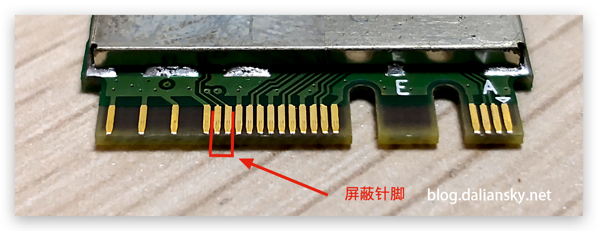

# Hackintosh for Lenovo ThinkCentre M90n-1

### Specification

| Component           | Details                                                   |
| ------------------- | --------------------------------------------------------- |
| Computer model      | Lenovo ThinkCentre M90n-1 (Model # 11AD000HAU)            |
| Processor           | i5-8265U                                                  |
| Memory              | 8GB DDR4-2666 Soldered                                    |
| Disk 1              | Samsung PM981a NVMe m.2 SSD 256GB (For Windows)           |
| Disk 2              | WD SN750 NVMe m.2 SSD 500GB (For Mac)                     |
| Integrated Graphics | Intel UHD Graphics 620                                    |
| Sound Chips         | Realtek ALC233                                            |
| Wireless/BT         | Intel 9560NGW -> Change to DW1820A (Pin masking required) |

### Pin masking
Pin masking is commonly required for Lenovo machines. Use a small strip of sticky tape to block the pins as demonstrated below:

